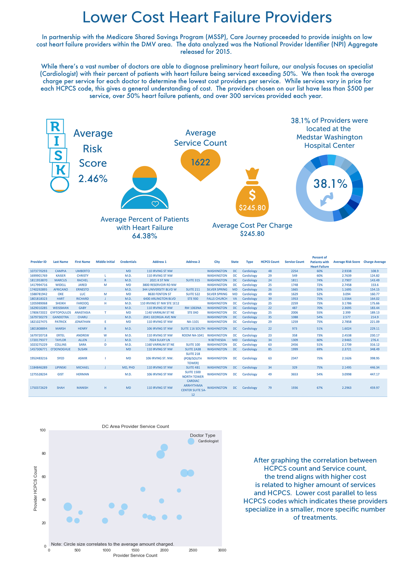

## ACO Low Cost Heart Providers

## Task

Analyze and Visualize the [2015 Medicare Provider Utilization & Payment Data](https://data.cms.gov/Medicare-Physician-Supplier/Medicare-Provider-Utilization-and-Payment-Data-Phy/sk9b-znav) and/or the [2015 Medicare Physician Identifier Report](https://data.cms.gov/Medicare-Physician-Supplier/Medicare-Physician-and-Other-Supplier-National-Pro/p3uv-6dv4) to determine the low cost options for heart failure patients in the DMV area. 

## Approach

Top 24 providers were determined by parsing the following:
	- Providers in the DC, Northern VA, and Southern MD cities.
	- Providers who have over 65% of patients that possess heart failure. 
    - Providers that have less than $800 per service on average for all services.
    - Providers that have over 300 services provided for the year.

## Conclusion

1. Despite have a higher threshold for cost, the average cost per service for our providers is $274.25.

2. The majority of providers found with lower cost were located at the Medstar Washington Hospital Center.

3. Average risk factor is very low at 2.75%.

4. Most providers do not provide more than 40 different services according to the amount of HCPCS codes per our low cost providers. The few providers that have recorded over 40 HCPCS codes have generally higher prices.  

## Assumption

1. Providers that offer more services are able to provide more expensive services.  This is why their cost is higher.

2. Providers that offer more services are also able to service more patients, therefore boosting their yearly income.

## Additional Request

1. A more specific request for certain HCPCS codes would allow the analysis to be more precise as there are hundreds of codes doctors use.  

